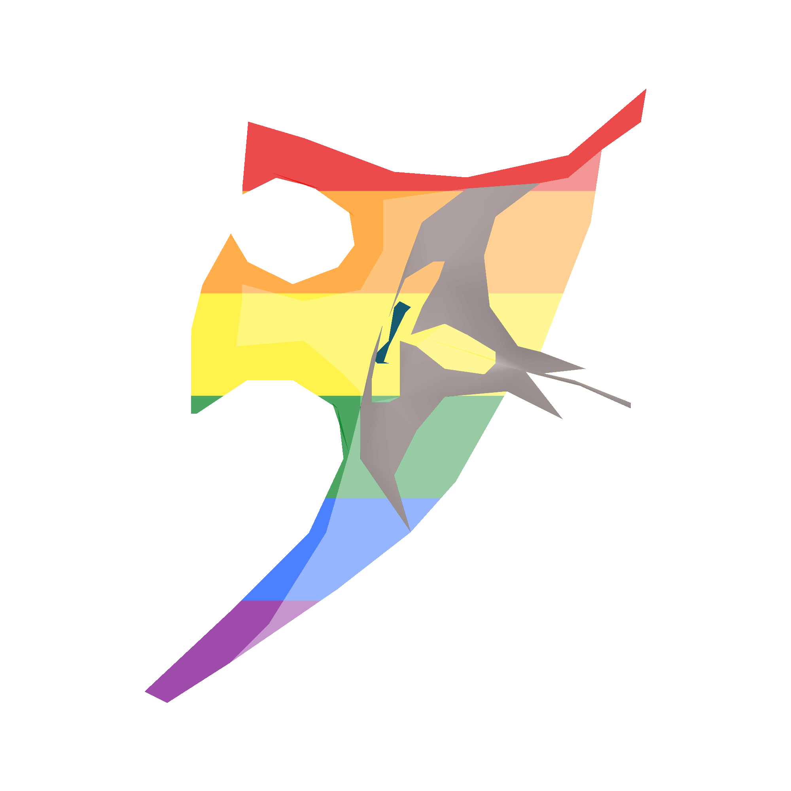

<div align="center">
<h1>Elysian Spirit</h1>


<p>
<strong><i>
Discord bot for the Old School RuneScape (OSRS) Elysium clan.<br> 
Manage clan points manually, track member activity, reward clan points based on TempleOSRS competitions, and more.
</i></strong>

Need more information? Any questions? Feel free to DM me on Discord: [@cyanthvibes](https://discordapp.com/users/187286355435454466/)
</p>
</div>

---

## Features

- Google Sheets integration to manage RuneScape (main and alt) accounts
- Track member activity in your Discord, and optionally via in-game clan chat
- Manage clan points:
  - Add or remove clan points
  - Allow users to claim clan points every day
  - Reward clan points based on TempleOSRS competition results
  - Robust tracking of transactions
- Customisable config per Discord server
- Easy setup with Docker or local environment

To-do:
- Allow members to submit event attendance reports
- Allow members to submit BotW drops, splits, bingo tile completions
- More advanced activity tracking by tracking the amount of messages a day and providing more granular options

---

## Pre-requisites

You can develop or run the bot using either Docker (recommended) or your local environment.

### Option A: Docker (recommended)

- [Docker](https://www.docker.com)
- [Buildx](https://github.com/docker/buildx)
- [Node.js 23](https://nodejs.org/en) or newer (to register commands)

### Option B: local

- [Node.js 23](https://nodejs.org/en) or newer
- [PostgreSQL](https://www.postgresql.org)

---

## Setup
### 1. Clone repository

```bash
git clone https://github.com/cyanthvibes/elysian-spirit.git
cd elysian-spirit
```

### 2. Create environment files

Create `.env.development` and/or `.env.production` based on `.env.example`

1. Go to the [Discord Developer Portal](https://discord.com/developers/applications/) and create an application
2. Under the **Bot** section, create a bot to obtain your `BOT_ID` and `BOT_TOKEN`
3. Enable all privileged gateway intents

### 3. Development server setup

1. Create a test server on Discord
2. Enable **Developer Mode** in your Discord client (Settings > Advanced)
3. Shift + right-click to copy:
   - `OWNER_ID` from your profile
   - `TEST_GUILD_ID` from your test server

**Important: for `.env.development`: `TEST_GUILD_ID` is required. For `.env.production`, it can be omitted.**

### 4. Configuration files

Create `config.json` based on `example_config.json`.

You'll need to add configuration for every Discord server the bot will serve.

`OSRS_CLAN_CHAT_CHANNEL` and `END_ROW` are optional.

### 5. Google credentials

1. Set up a Google Spreadsheet or use existing one
2. Set up API access to the spreadsheet and get a `google_credentials.json` file
3. The spreadsheet must include the following columns:
    - RSN
    - Discord IDs
    - ALTs
    <br>
    (Exact columns can be configured in `config.json`)
4. Rename the file to `[guild_id]_google_credentials.json` and place it in `/google_credentials/`

### 6. Invite the bot to your test server

Use the OAuth2 URL Generator in the Developer Portal (`bot` scope), or use:

`https://discord.com/oauth2/authorize?client_id=${BOT_ID}&permissions=0&integration_type=0&scope=bot`

### 7. Enable commands for your server

Bot owners can always use every command, everywhere.

By default, commands are disabled for every guild the bot is in. You can enable or disable them by using this command in the chat:
`[prefix]commands enable|disable`

If commands are disabled, staff can still use commands where `isPrivileged = true`.

---

## Development

### Registering slash commands

Slash commands must be registered to Discord before they appear. 

This can be done globally (about once an hour, otherwise rate-limited), or for your test guild.

For development:
```bash
# Install dependencies
npm install

# register commands (guild or global)
npm run register-guild-dev
npm run register-global-dev

# clear commands
npm run clear-guild-dev
npm run clear-global-dev
```

### Using docker (recommended)

```bash
make dev          # Build & run dev containers with Docker Bake and Compose
make dev-up       # Start dev containers
make dev-down     # Stop dev containers
```

- Automatically runs Prisma migrations and generates the Prisma client
- Starts the bot in development mode and using `tsx watch` for hot-reloading


### Running locally (without Docker)

Ensure PostgreSQL is installed and running.

```bash
# Install dependencies (only once or when package.json changes)
npm install

npx prisma migrate deploy
npx prisma generate

# Start the bot in development mode
npm run dev
```

---

## Production

### Registering slash commands

Slash commands must be registered to Discord before they appear.

This can be done globally (about once an hour, otherwise rate-limited), or for your test guild.

For production:
```bash
# Install dependencies
npm install

# register commands (guild or global)
npm run register-guild-prod
npm run register-global-prod

# clear commands
npm run clear-guild-prod
npm run clear-global-prod
```

### Using docker (recommended)

```bash
make prod         # Build & run production containers
make prod-up      # Start production containers
make prod-down    # Stop production containers
```

- Automatically runs Prisma migrations and generates the Prisma client
- Starts the bot in production mode

### Running locally (without Docker)

Ensure PostgreSQL is installed and running.

```bash
# Install dependencies (only once or when package.json changes)
npm install 

npx prisma migrate deploy
npx prisma generate

# Build the production bundle
npm run build:full

# Start the bot
npm run prod
```

---

## Contributing

1. Fork this repository and clone your fork
2. Create a new branch for your feature or bugfix
3. Make your changes
4. Run `npm run lint`, `npm run prettier`, and `npm run build`, to ensure code quality
5. Commit your changes and push your branch (check out: [gitmoji](https://gitmoji.dev))
6. Open a pull request describing your changes

Please follow the existing code style and conventions. If you have any questions or want to discuss a feature, open an issue or start a discussion.

Feel free to DM me on Discord: [@cyanthvibes](https://discordapp.com/users/187286355435454466/)


